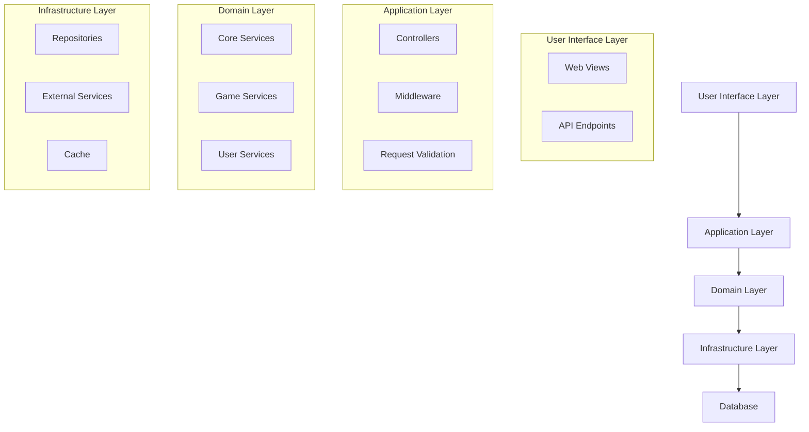
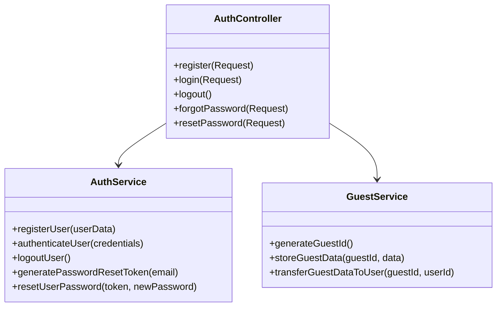
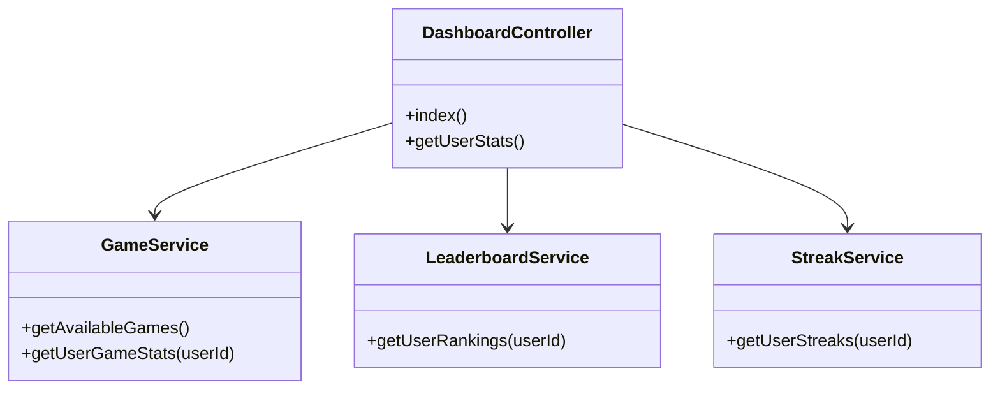
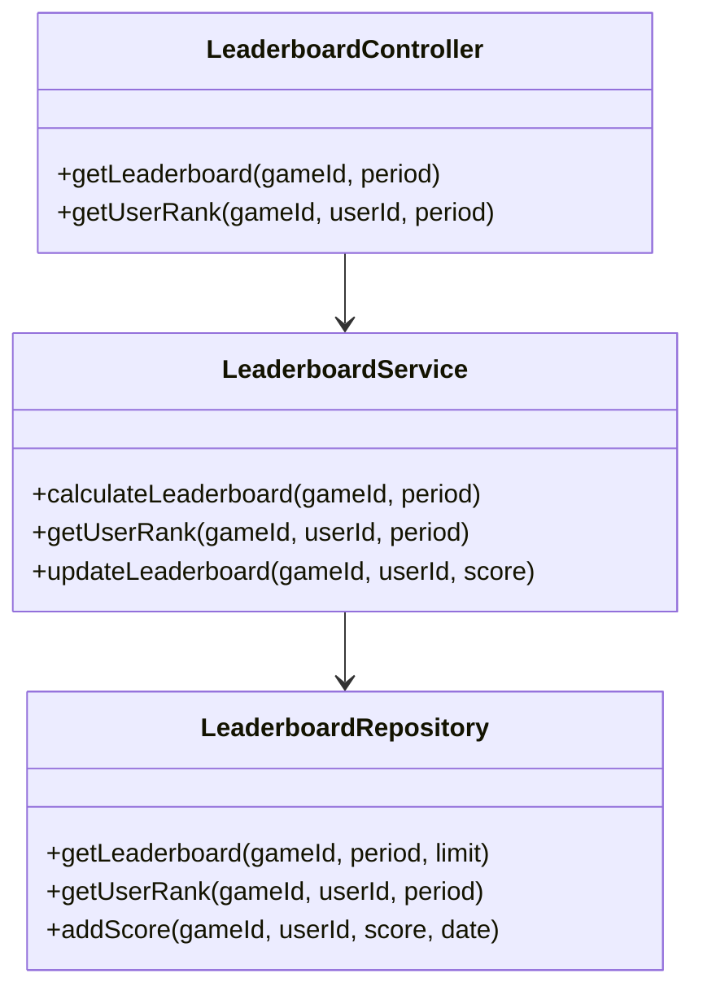
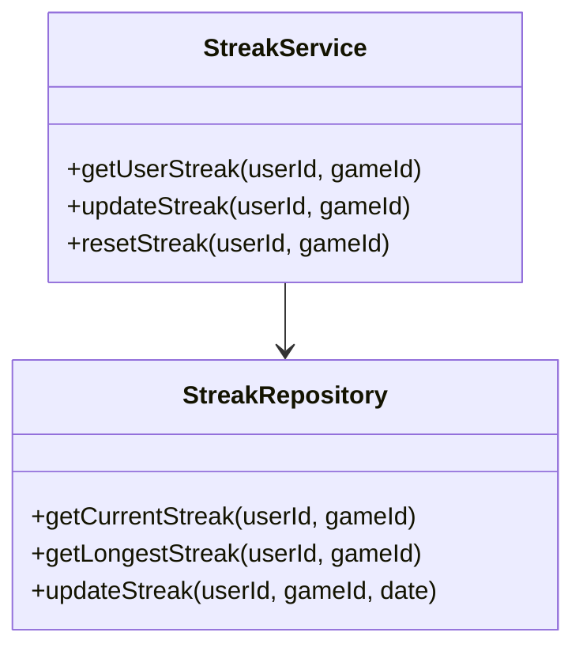
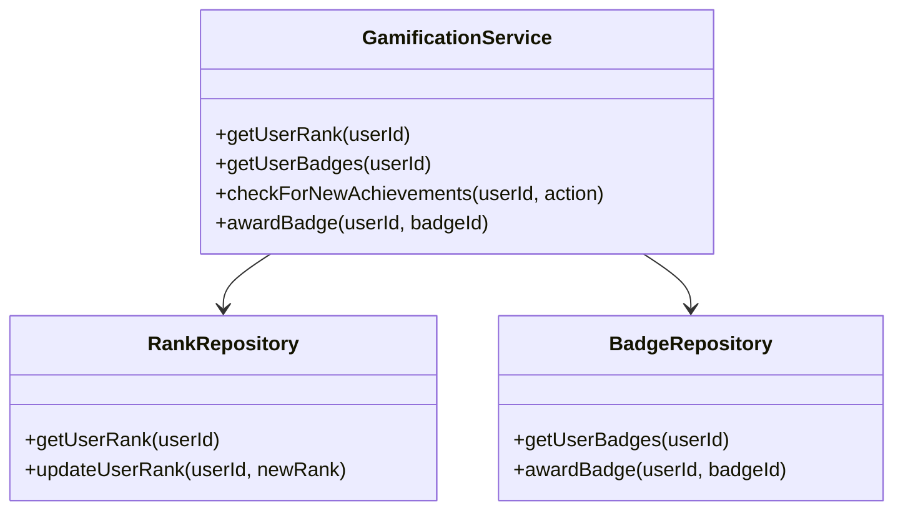
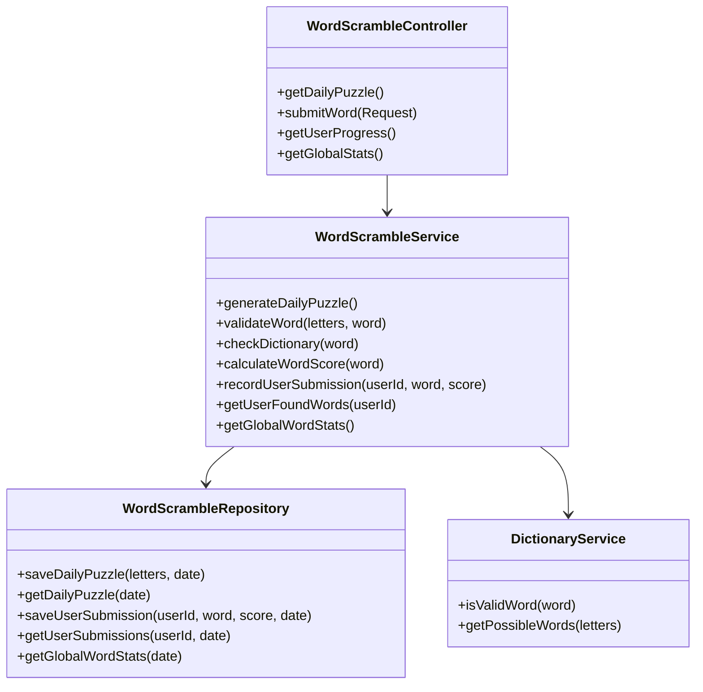

# Design Document: Daily Games Platform

## Overview

The Daily Games Platform is a Laravel-based web application that hosts multiple simple daily games with a shared user system. The platform will initially feature a Daily Word Scramble game, with plans to add more games in the future. Each game will have its own logic and data while sharing core platform features like user authentication, leaderboards, and streak tracking.

This design document outlines the architecture, components, data models, and implementation strategies for the platform, with a focus on scalability, maintainability, and user experience.

## Architecture

The platform will follow a modular architecture based on Laravel's MVC pattern, with additional layers to support game-specific logic and shared services.

### High-Level Architecture



### Core Architecture Principles

1. **Modular Design**: Each game will be implemented as a separate module with its own controllers, services, and repositories, but sharing common infrastructure.

2. **Service-Oriented**: Core functionality like authentication, leaderboards, and streak tracking will be implemented as services that can be used by any game.

3. **Repository Pattern**: Data access will be abstracted through repositories to decouple business logic from data storage.

4. **Event-Driven**: Key actions (like completing a game or achieving a streak) will trigger events that can be handled by various listeners.

5. **API-First**: All functionality will be exposed through a RESTful API, which will be consumed by the web frontend and potentially mobile apps in the future.

## Components and Interfaces

### Core Components

#### Authentication System

The authentication system will handle user registration, login, and session management. It will support both traditional email/password authentication and social login (Google).



#### Dashboard System

The dashboard will provide a central hub for users to access all games, view their progress, and check leaderboards.



#### Leaderboard System

The leaderboard system will track and display user rankings across different time periods (daily, monthly, all-time).



#### Streak System

The streak system will track consecutive days of play for each user and game.



#### Gamification System

The gamification system will handle ranks, badges, and achievements.



### Game-Specific Components

#### Word Scramble Game



### Interface Definitions

#### API Endpoints

The platform will expose the following key API endpoints:

1. **Authentication**
   - `POST /api/auth/register` - Register a new user
   - `POST /api/auth/login` - Log in a user
   - `POST /api/auth/logout` - Log out a user
   - `POST /api/auth/password/email` - Send password reset email
   - `POST /api/auth/password/reset` - Reset password
   - `POST /api/auth/guest/transfer` - Transfer guest data to user account

2. **Dashboard**
   - `GET /api/dashboard` - Get dashboard data
   - `GET /api/dashboard/stats` - Get user stats across all games

3. **Leaderboards**
   - `GET /api/leaderboards/{gameId}/{period}` - Get leaderboard for a game and period
   - `GET /api/leaderboards/{gameId}/user` - Get user's rank for a game

4. **Word Scramble Game**
   - `GET /api/games/word-scramble/puzzle` - Get today's puzzle
   - `POST /api/games/word-scramble/submit` - Submit a word
   - `GET /api/games/word-scramble/progress` - Get user's progress
   - `GET /api/games/word-scramble/stats` - Get global stats for today's puzzle

5. **User Profile**
   - `GET /api/user/profile` - Get user profile
   - `PUT /api/user/profile` - Update user profile
   - `GET /api/user/streaks` - Get user's streaks
   - `GET /api/user/badges` - Get user's badges

## Data Models

### Core Data Models

#### User

```
User
├── id (primary key)
├── name
├── email
├── password
├── avatar
├── provider (for social login)
├── provider_id (for social login)
├── remember_token
├── created_at
└── updated_at
```

#### Guest

```
Guest
├── id (primary key)
├── guest_token (stored in cookie)
├── created_at
└── updated_at
```

#### GuestData

```
GuestData
├── id (primary key)
├── guest_id (foreign key to Guest)
├── key (e.g., 'word_scramble_progress')
├── value (JSON)
├── created_at
└── updated_at
```

#### Game

```
Game
├── id (primary key)
├── slug (e.g., 'word-scramble')
├── name
├── description
├── is_active
├── created_at
└── updated_at
```

#### UserGameStats

```
UserGameStats
├── id (primary key)
├── user_id (foreign key to User)
├── game_id (foreign key to Game)
├── total_score
├── plays_count
├── last_played_at
├── created_at
└── updated_at
```

#### Streak

```
Streak
├── id (primary key)
├── user_id (foreign key to User)
├── game_id (foreign key to Game)
├── current_streak
├── longest_streak
├── last_played_date
├── created_at
└── updated_at
```

#### Leaderboard

```
Leaderboard
├── id (primary key)
├── game_id (foreign key to Game)
├── user_id (foreign key to User)
├── score
├── period_type (daily, monthly, all-time)
├── period_date
├── created_at
└── updated_at
```

#### Rank

```
Rank
├── id (primary key)
├── name
├── threshold (minimum score to achieve this rank)
├── icon
├── created_at
└── updated_at
```

#### UserRank

```
UserRank
├── id (primary key)
├── user_id (foreign key to User)
├── rank_id (foreign key to Rank)
├── created_at
└── updated_at
```

#### Badge

```
Badge
├── id (primary key)
├── name
├── description
├── icon
├── criteria (JSON with achievement criteria)
├── created_at
└── updated_at
```

#### UserBadge

```
UserBadge
├── id (primary key)
├── user_id (foreign key to User)
├── badge_id (foreign key to Badge)
├── awarded_at
├── created_at
└── updated_at
```

### Game-Specific Data Models

#### WordScramblePuzzle

```
WordScramblePuzzle
├── id (primary key)
├── letters
├── date
├── possible_words_count
├── created_at
└── updated_at
```

#### WordScrambleWord

```
WordScrambleWord
├── id (primary key)
├── puzzle_id (foreign key to WordScramblePuzzle)
├── word
├── score
├── created_at
└── updated_at
```

#### WordScrambleUserSubmission

```
WordScrambleUserSubmission
├── id (primary key)
├── user_id (foreign key to User)
├── puzzle_id (foreign key to WordScramblePuzzle)
├── word
├── score
├── created_at
└── updated_at
```

#### WordScrambleGuestSubmission

```
WordScrambleGuestSubmission
├── id (primary key)
├── guest_id (foreign key to Guest)
├── puzzle_id (foreign key to WordScramblePuzzle)
├── word
├── score
├── created_at
└── updated_at
```

## Error Handling

The platform will implement a comprehensive error handling strategy:

1. **API Error Responses**: All API endpoints will return consistent error responses with appropriate HTTP status codes and error messages.

2. **Validation Errors**: Input validation will be performed using Laravel's validation system, with clear error messages returned to the client.

3. **Exception Handling**: Custom exception classes will be created for different types of errors (e.g., GameNotFoundException, InvalidWordException), with a global exception handler to convert them to appropriate API responses.

4. **Logging**: All errors will be logged using Laravel's logging system, with different severity levels based on the error type.

5. **User-Friendly Error Messages**: Error messages displayed to users will be clear and actionable, without exposing technical details.

## Testing Strategy

The platform will be tested at multiple levels:

1. **Unit Tests**: Test individual components in isolation, mocking dependencies as needed.
   - Test services, repositories, and other business logic
   - Test validation rules
   - Test game-specific algorithms (e.g., word validation)

2. **Integration Tests**: Test interactions between components.
   - Test API endpoints
   - Test database interactions
   - Test event listeners

3. **Feature Tests**: Test complete features from end to end.
   - Test user registration and login flow
   - Test game play flow
   - Test leaderboard updates

4. **Browser Tests**: Test the UI using Laravel Dusk.
   - Test user interactions
   - Test responsive design
   - Test accessibility

5. **Performance Tests**: Test the platform under load.
   - Test API response times
   - Test database query performance
   - Test caching effectiveness

## Security Considerations

1. **Authentication**: Use Laravel Sanctum for API authentication, with proper token management and CSRF protection.

2. **Authorization**: Implement role-based access control for administrative functions.

3. **Data Validation**: Validate all user input on both client and server sides.

4. **HTTPS**: Enforce HTTPS for all connections.

5. **Cookie Security**: Set secure and SameSite attributes for cookies.

6. **Rate Limiting**: Implement rate limiting for API endpoints to prevent abuse.

7. **SQL Injection Protection**: Use Laravel's query builder and Eloquent ORM to prevent SQL injection.

8. **XSS Protection**: Escape output and use Content Security Policy headers.

9. **CSRF Protection**: Use Laravel's built-in CSRF protection for web routes.

10. **Sensitive Data**: Encrypt sensitive data at rest and in transit.

## Implementation Considerations

### Caching Strategy

To ensure good performance, the platform will implement caching at several levels:

1. **Leaderboard Caching**: Cache leaderboards with a short TTL (e.g., 5 minutes).

2. **Daily Puzzle Caching**: Cache the daily puzzle for the entire day.

3. **User Stats Caching**: Cache user stats with a short TTL, invalidating on updates.

4. **Database Query Caching**: Cache frequent database queries.

5. **API Response Caching**: Cache API responses where appropriate.

### Scalability

The platform will be designed for horizontal scalability:

1. **Stateless API**: The API will be stateless, allowing for multiple instances behind a load balancer.

2. **Database Scaling**: Use database indexing and consider sharding for high-traffic tables.

3. **Caching Layer**: Use Redis for caching and session storage.

4. **Queue System**: Use Laravel's queue system for background processing of non-time-critical tasks.

5. **CDN**: Use a CDN for static assets.

### Frontend Architecture

The frontend will be built using Laravel Blade templates with Vue.js components for interactive elements:

1. **Blade Templates**: For page structure and server-rendered content.

2. **Vue.js Components**: For interactive game elements, leaderboards, and user dashboards.

3. **Tailwind CSS**: For styling, ensuring a responsive and consistent design.

4. **Alpine.js**: For simple interactions without the need for full Vue components.

5. **Livewire**: For reactive components that require server interaction.

### Mobile Responsiveness

The platform will be fully responsive, with a mobile-first design approach:

1. **Responsive Grid**: Use Tailwind's responsive grid system.

2. **Touch-Friendly UI**: Ensure all interactive elements are touch-friendly.

3. **Adaptive Layout**: Adjust layout based on screen size.

4. **Performance Optimization**: Optimize asset loading for mobile devices.

## Game-Specific Design: Word Scramble

### Game Flow

1. User accesses the Word Scramble game.
2. System displays today's scrambled letters.
3. User enters words formed from the letters.
4. System validates each word and awards points.
5. User can see their found words and total score.
6. User can see global stats (how many words found by all players).
7. At the end of the day, leaderboards are updated.

### Word Validation Algorithm

1. Check if the word uses only the provided letters (accounting for letter frequency).
2. Check if the word is at least 3 letters long.
3. Check if the word exists in the dictionary.
4. Check if the user has already found this word.

### Scoring System

The scoring system will be Scrabble-style, with points based on letter values and word length:

- 3-letter words: base score
- 4-letter words: higher score
- 5+ letter words: significantly higher score
- Bonus for finding all possible words

### Dictionary Integration

The platform will integrate with a dictionary API or use a local dictionary database to validate words. The dictionary will be cached for performance.

### Daily Puzzle Generation

1. Select a set of 7 letters that can form multiple valid words.
2. Ensure a good distribution of vowels and consonants.
3. Pre-calculate all possible words and their scores.
4. Store the puzzle and possible words in the database.

## Future Game Integration

The platform is designed to easily integrate new games:

1. Create a new game module with its own controllers, services, and repositories.
2. Implement the game-specific logic and data models.
3. Register the game with the core platform.
4. The shared services (authentication, leaderboards, streaks) will automatically work with the new game.

Each new game will follow the same architectural patterns but can have its own unique gameplay mechanics and data structures.

## Deployment Strategy

The platform will be deployed on Laravel Cloud with PostgreSQL as the database:

1. **Development Environment**: For active development and testing.
2. **Staging Environment**: For pre-production testing.
3. **Production Environment**: For the live application.

Each environment will have its own PostgreSQL database instance and cache instances.

### Laravel Cloud Configuration

The platform will leverage Laravel Cloud's features:

1. **Managed PostgreSQL**: Use Laravel Cloud's managed PostgreSQL service.
2. **Auto-scaling**: Configure auto-scaling based on traffic patterns.
3. **CI/CD Integration**: Set up automatic deployments from the Git repository.
4. **Environment Variables**: Store configuration in Laravel Cloud environment variables.
5. **Monitoring**: Use Laravel Cloud's built-in monitoring tools.
6. **Backups**: Configure automated database backups.

## Monitoring and Analytics

The platform will include monitoring and analytics:

1. **Error Tracking**: Use a service like Sentry to track errors.
2. **Performance Monitoring**: Monitor API response times and database query performance.
3. **User Analytics**: Track user engagement, retention, and game performance.
4. **Server Monitoring**: Monitor server resources and availability.

## Conclusion

This design document outlines the architecture, components, data models, and implementation strategies for the Daily Games Platform. The modular design allows for easy addition of new games while maintaining a consistent user experience and shared infrastructure. The platform prioritizes performance, scalability, and security while providing an engaging and gamified experience for users.